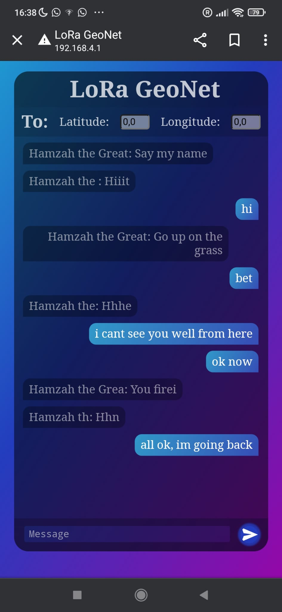
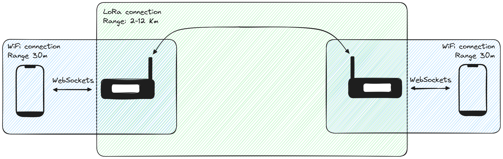
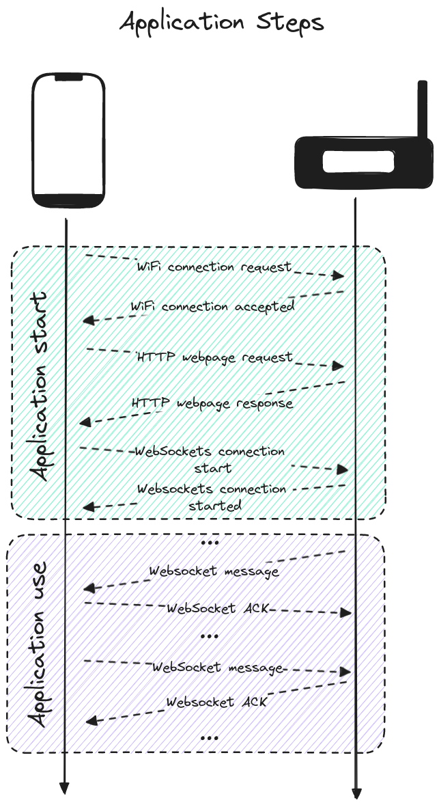

# LoRa_GeoNet

Proyect with the purpose of creating a long range, low cost messaging infrastructure using LoRa technology.


Do you want to send messages between 2 phones without using the conventional cellular network? With this project, you can! You need:
- 2 phones
- 2 or more esp32 with LoRa antennas and batteries

> The range between 2 LoRa devices can be higher than 10 Km if they are within line of sight!


How does it look?:
| Phone screen | LoRa devices |
| - | - |
|  |  |

How are messages sent/received on a 2 node architecture:



How messages are sent/received with a multiple-node architecture:


How the application works:



## Getting started

<details>

### Dependencies

- ESPAsyncWebServer: https://github.com/ESP32Async/ESPAsyncWebServer/
- AsyncTCP: https://github.com/ESP32Async/AsyncTCP
- LoRa: https://github.com/sandeepmistry/arduino-LoRa
- OLED display: https://github.com/ThingPulse/esp8266-oled-ssd1306
- Arduino JSON: https://github.com/bblanchon/ArduinoJson
- QRCodeGenerator: https://github.com/felixerdy/QRCodeGenerator


### Project

The steps required:
1. Download and change the code to fit your devices
2. Compile it and upload it to the boards
3. Set the LoRa devices close to the phones and within line of sight of each other
4. Connect your phone to the WiFi of the closest LoRa device
5. Open your browser and put on the URL the IP or the network router
6. You can now send messages!

This project needs you to create a file `secrets.h` inside the project folder with the content:
```h
#define AP_SSID         ""
#define AP_PASSWORD     ""
```

> To use the loraWsMock (to test the code, not needed to use the project) it is needed to create a symbolic link in that folder to the `secrets.h` file in the project folder. The loraWsMock has Windows symbolic links. It would not work in Linux unless these files are replace with Linux symbolic links

> Note: Tested with the esp32 library version 2.0.0, board TTGO LoRa32-OLED V1 (for LilyGO esp32 LoRa v1.3)

</details>


## Characteristics

<details>

### Positives

- **Long range**: LoRa enables connections between nodes hundreds of kilometers apart
- **Low cost infrastructure**: each node costs around 20$ (battery included)
- **Energy efficient**: node consumption is inferior to traditional switches and routers, it can be powered with a small solar panel and a battery

### Negatives

- **Line of Sight required between nodes**: obstacles may obstruct the signal between 2 nodes. The routing is made so that there are available connections between several nodes so that only one mesh is formed
- **Low bitrate**: LoRa technology has restrictions on the maximum bitrate. In this application, messages have a maximum size of 144 characters in order to abide with the law, although even using 100% of the bandwidth wouldn't allow for traditional network uses like: streaming, VoIP, HTTP websites...etc.
- **Not scalable for thousands of users**: the network may allow dozens of users simultaneously using the infrastructure, but due to the long wireless reach, the noise generated by other users is propagated. Therefore, there is a limit in local users in the availability of the service

</details>
